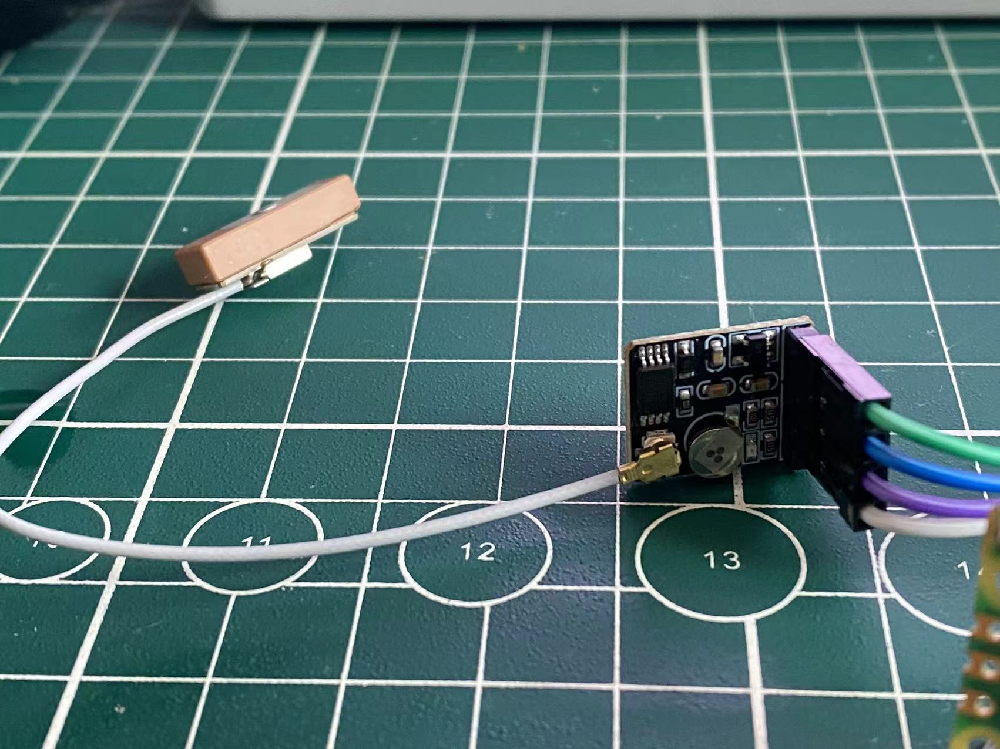

# atgm336
micropython ATGM336 GPS models [ESP32 RP2040]

```
from machine import UART,Pin
import time
from atgm336 import gps

uart=UART(0,9600)
g=gps(uart)


while True:
    if g.gll():
        print(g.gps)
    time.sleep(0.1)    
```

`
[43.13318, 'N', 140.134, 'E', ['03', '18', '50']]
`
